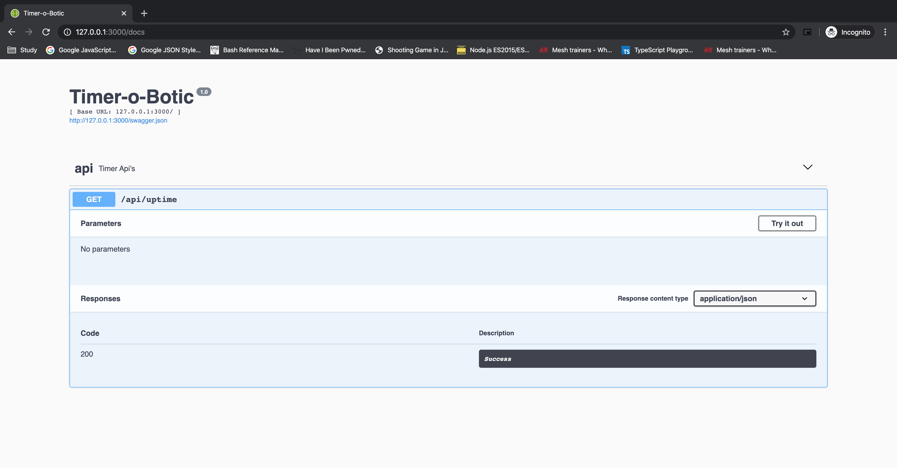

## Timer-o-botic

This application demonstrates API service with endpoint **/uptime** that returns the current date time, application uptime(in secs), api response time(in ms) and request execution time(in ms).

## Approach
Implement a modular application, where each component/resource can be used independently. The primary consideration in this implementation was not to reinvent the wheel. Ex., rather than writing the OpenAPI spec file and integrating swagger-ui for application documentation instead, I have used Flask-restful for it.

**Application Uptime(in secs):** Time elapsed since the application server was started. Used `before_first_request` and `after_this_request` hooks to calculate the time.
**Api Response time(in ms):** Time took by the application server to process the request i.e., the time difference of request received and before sending a response back. Used `before_request` and `after_this_request` hooks to calculate the time.
**Request Execution time(in ms):** Time spent on executing api logic. For `/uptime` api, time spent on getting the current date and time returning that response. Used a custom hook `execution_time` to calculate the time.

## Prerequisite
* Python3
* pip3

## Swagger UI

## How to get up and running
Clone the project to your host. Navigate to the directory in which you cloned the project.
1. Install Requirements
    ```
    $ pip3 install -r requirements.txt
    ```
2. Run the application
    ```
    $ python3 app.py --env dev
    ```
    Default `--env`: **dev**
    Valid `--env`: **dev** / **stg** / **prod**
    
3. Call `/uptime` api
    ```
    $ curl -X GET http://127.0.0.1:3000/api/uptime
    ```
    Sample response:
    ```
    {
      "appUptimeSec": 41, 
      "currentDateTime": "2020-03-22 19:56:53 EST", 
      "executionTimeMs": "0.0350", 
      "responseTimeMs": "0.3064"
    }
    ```
